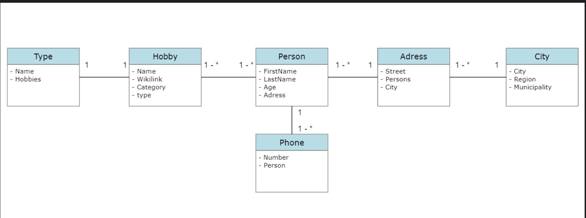
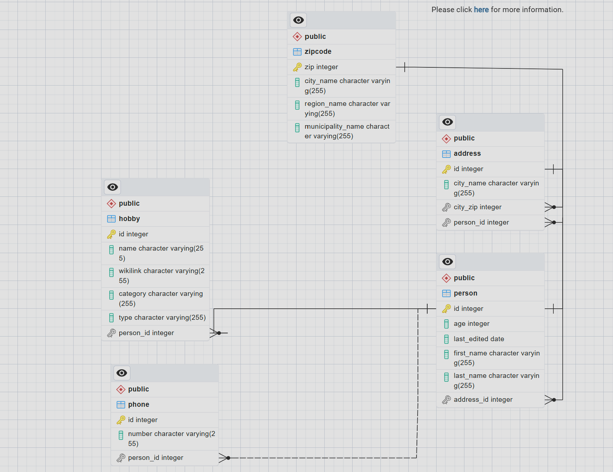

## A description of business idea

- Our application is designed to connect individuals with similar hobbies and interests. The app is designed to bridge the gap by creating a platform where people can connect and engage with others in the safety and comfort of their own home.

- here is a picture of our domain model:

- and here is a picture of our EER diagram:

## User Stories

- **[US-1]**: As a user I want to get all the information about a person
- **[US-2]**: As a user I want to get all phone numbers from a given person
- **[US-3]**: As a user I want to get all persons with a given hobby
- **[US-4]**: As a user I want to get the number of people with a given hobby
- **[US-5]**: As a user I want to get a list all hobbies + a count of how many are interested in each hobby
- **[US-6]**: As a user I want to get all persons living in a given city (i.e. 2800 Lyngby)
- **[US-7]**: As a user I want to get a list of all postcodes and city names in Denmark
- **[US-8]**: As a user I want to get all the information about a person (address, hobbies etc.) given a phone number
- **[US-9]**: As a user I want to be able to do CRUD operations on all JPA entities unless it wouldn't make sense for a given entity.
## Project requirements
**[R-1]**:
- JPA
- JPQL
- Maven
- JDK 17
- JUnit 5
- Docker
- PostgresSQL
- pgAdmin
- Lombok
- **[R-2]**: The project must contain a meaningful EER-diagram (use pgAdmin to create the diagram)
- **[R-3]**: The project must be documented in a README.md file(*)
-  **[R-4]**: The project must contain meaningful unit tests. (70 - 80 % of the methods must be tested (DAO, Entity ...))
-  **[R-5]**: JPA annotations must be used for mapping domain classes
-  **[R-6]**: JPQL must be used for all CRUD operations
-  **[R-7]**: JPA annotations must include minimum once an @Enumerated, @PrePersist and @PreUpdate.
-  **[R-8]**: The phone number as to follow the Danish rules for phone numbers (e.g. +45 12345678)
-  **[R-9]**: If you use a Date property in an entity, it must be a java.time.LocalDate, java.time.Date or java.time.LocalDateTime and not just a String
-  **[R-10 ]**: DAO classes should follow the Singleton Pattern

## Acknowledgments

I would like to acknowledge the time and effort I have dedicated to this project. Despite encountering challenges along the way, I am proud to have accomplished what I could. This project reflects my perseverance and determination to overcome obstacles. 

